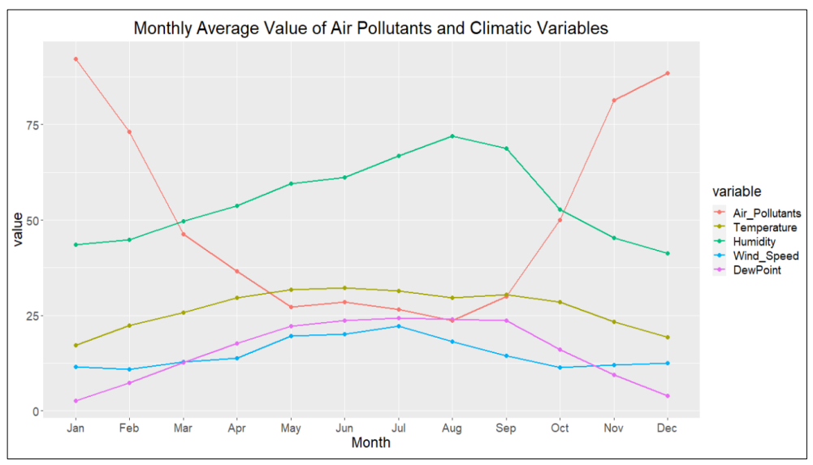
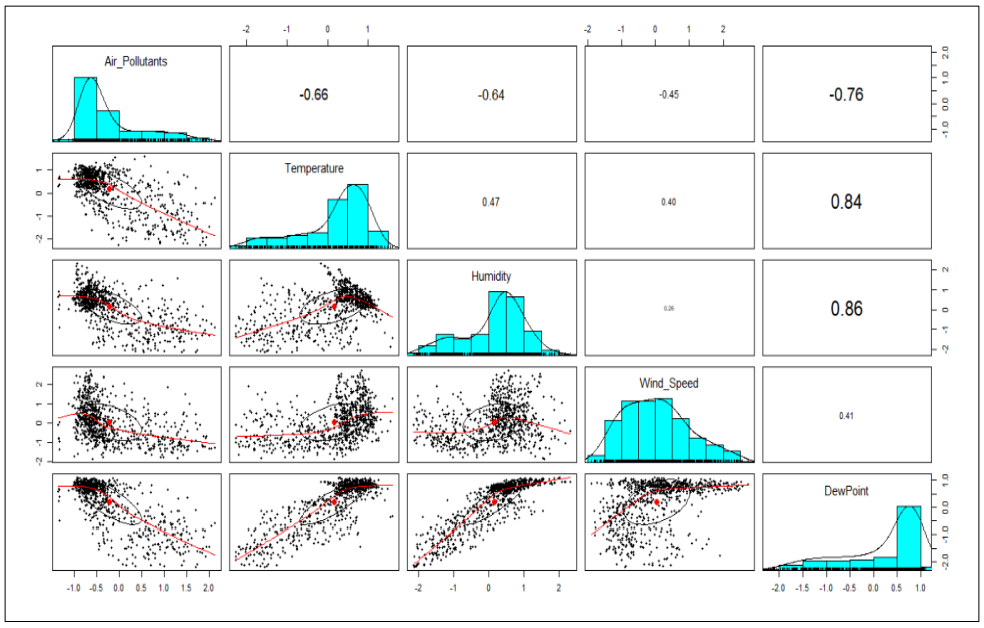
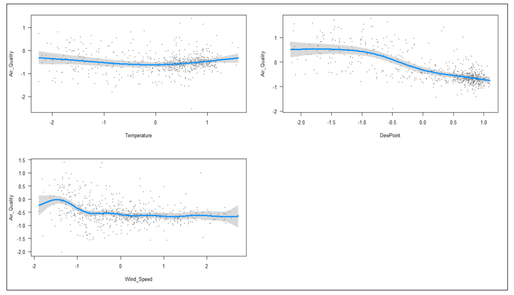

# Impacts of Meteorological Factors on Air Pollutants PM2.5

## Objective
The impact of temperature, wind speed, dew point, and humidity on air pollutants concentration is investigated 

## Resources
Datasets
- [Hourly air pollutants data (PM2.5 µg/m3)](https://openaq.org/#/)
- [Daily meteorological dataset)](https://www.wunderground.com/)

  

## Methodology
During the initial stages of model development, relationships between climatic variables and PM2.5
is investigated. Mean daily values for air pollutants were obtained to investigate the correlation
with meteorological factors.

  

Multiple linear regression modeling and multiple nonlinear regression modeling using GAM
has been conducted for meteorological variables after analyzing scatter plots. 

## Results
Local and seasonal weather patterns’ influence on the variability of air pollutants (PM2.5) concentration was investigated using a variety of statistical models.
Based on the statistical correlations between PM2.5 and meteorological factors, the optimal method forpredicting air pollutants (PM2.5) concentration was developed. 
The concentration of air contaminants was predicted with 64% accuracy using climatic variables by applying. The concentration of air contaminants is also impacted by anthropogenic activities such as industrialization,
urbanization, and automobile emissions. As a result, other factors should also be incorporated in order to estimate air pollutants concentration more accurately.

  

